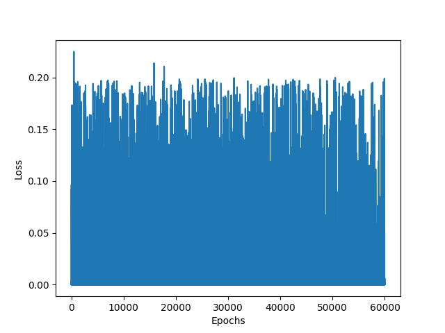
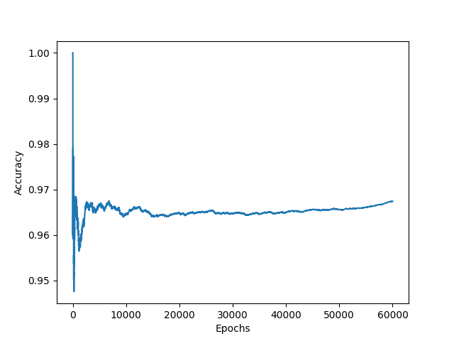

# lily
This is Neural Network written from scratch (No ML libraries) in python and numpy. As such can be easily re-written in another language with the relevent linear algerba library.
(if you are brave you can easily write one yourself. Just a matrix class and a few operations)

I named the project after the plant lily, a small pretty plant that is surrounded by big trees ( Big ML)

## Usage
You can train the model by executing the following command:
```bash
python lily.py
```
It takes about 5min per iteration (through 60K MNIST images)on my i5-4300U CPU. After Three iterations, we achieve ~98% test accuracy on MNIST dataset.
I know, should be seperate the training data from test data. I was testing my attempt at the RMSProp optimizer and got too busy with other projects to do proper testing. This is a MVP 

## parameters
I haven't 'optimized' my parameters, becauase i too busy with other projects but her is what i have
- activation: sigmoid
- optimizer RMSprop, ( Adam is coded in but has bugs, i will fix later)
- batch size: 1  
- learning rate             : 0.8  
- beta in momentum optimizer: 0.9
## Results (after 2 epochs)
<p align="center">
	 
        
</p>

## P.S.
- The code is messy filled with a lot of commeted out code, ignore these. I was busy running expirements, trying to implent RMSprop, Adam and learning how to validate neural networks
- I code this to learn about ML and run expirments. I don't have plans to update it anytime soon, I am too busy having fun with Pytorch and looking for a GPU. Don't expect updates.

## Reference 
[Neural Networks and Deep Learning](http://neuralnetworksanddeeplearning.com/), Great starting point
